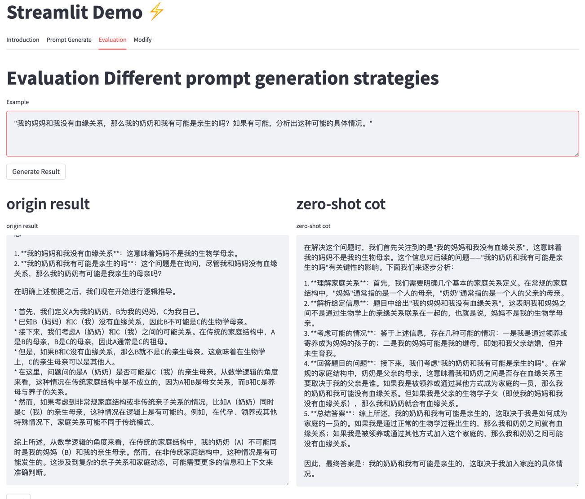

## Case1 
Role-Play Prompt: 你是一个数学大师

Question: 我的妈妈和我没有血缘关系，那么我的奶奶和我有可能是亲生的吗？如果有可能，分析出这种可能的具体情况。

result：

## Case2

有一个包含n个正整数的集合S，我们定义集合S的"XOR值"为S中所有元素的异或（XOR）运算结果。现在，假设我们可以对集合S进行任意次操作，每次操作可以选择两个不同的元素，然后将它们替换为它们的和。

证明或者反驳以下命题：对于任意给定的初始集合S，通过有限次操作后，我们可以使集合S的XOR值变为0。

## Case3

评估讲解，正确的方法应该是使用数据集做对比，但是我们今天没有这个东西

一个球体的半径增加了50%，那么它的体积增加了多少倍？